

  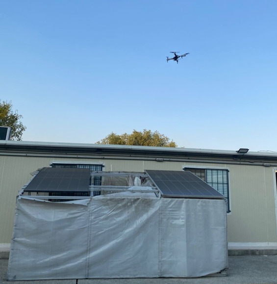

<h1 align="center">🚁 Dron para la Inspección Inteligente de Sistemas Fotovoltaicos</h1>

Sistema desarrollado para la detección de <strong>puntos calientes (Hot Spots)</strong> en paneles solares mediante visión térmica, geolocalización y monitoreo ambiental, reduciendo riesgos laborales y optimizando los tiempos de inspección.

---

# 📖 Descripción

Este proyecto consiste en el diseño y desarrollo de un *dron inteligente* para la inspección de sistemas fotovoltaicos, integrando una *cámara térmica ESP32-S3, un **módulo GPS* y diversos *sensores ambientales* para obtener información en tiempo real durante las inspecciones.

El principal objetivo del sistema es *detectar puntos calientes (Hot Spots)* en paneles solares, permitiendo identificar oportunamente anomalías térmicas ocasionadas por celdas dañadas, conexiones defectuosas, suciedad, sombreado o fallas eléctricas que afectan la eficiencia del sistema fotovoltaico.

A diferencia de los métodos convencionales de inspección, donde el personal debe recorrer manualmente grandes instalaciones y realizar trabajos en altura, este proyecto permite efectuar inspecciones de forma *rápida, segura y eficiente*, disminuyendo considerablemente el tiempo de análisis.

Asimismo, el uso del dron contribuye a la *reducción de riesgos laborales*, evitando que los técnicos se expongan a trabajos en altura, mejorando las condiciones de seguridad y reduciendo la probabilidad de accidentes durante las actividades de mantenimiento.

Este proyecto fue desarrollado como propuesta tecnológica para demostrar cómo la integración de *sistemas embebidos, **visión térmica, **automatización, **IoT* y *energías renovables* puede optimizar los procesos de inspección dentro del sector energético.

---

# ⚠️ Problemática

Actualmente, la inspección de sistemas fotovoltaicos continúa realizándose, en muchos casos, mediante procedimientos manuales que requieren que el personal técnico recorra grandes extensiones de paneles solares.

Este proceso implica:

- Riesgos asociados a trabajos en altura.
- Mayor tiempo de inspección.
- Incremento en los costos operativos.
- Dificultad para detectar fallas térmicas de manera oportuna.
- Mayor exposición del personal a condiciones ambientales.

Como solución, este proyecto propone el uso de un dron equipado con una cámara térmica y sensores inteligentes, capaz de realizar inspecciones remotas de forma rápida, segura y precisa.

---

# 🎯 Objetivos

- Detectar puntos calientes (Hot Spots) en paneles solares mediante imágenes térmicas.
- Reducir los riesgos laborales asociados a trabajos en altura.
- Disminuir el tiempo requerido para las inspecciones en comparación con los métodos tradicionales.
- Obtener la ubicación exacta de cada inspección mediante GPS.
- Monitorear temperatura, humedad e iluminación ambiental.
- Mejorar la eficiencia del mantenimiento preventivo y correctivo en sistemas fotovoltaicos.
- Implementar una solución tecnológica enfocada en la Industria 4.0 y las Energías Renovables.

---

# ✨ Características principales

- 📷 Cámara térmica para detección de anomalías.
- 🌍 Geolocalización mediante GPS.
- 🌡️ Monitoreo de temperatura y humedad.
- ☀️ Medición de iluminación ambiental.
- 📡 Comunicación inalámbrica mediante Wi-Fi.
- 📱 Visualización de datos en tiempo real.
- 🔋 Plataforma de bajo consumo energético.
- ⚡ Inspección rápida de instalaciones fotovoltaicas.
- 🦺 Reducción de riesgos para el personal técnico.

---

# ⚙️ Funcionamiento del sistema

El proceso de inspección se desarrolla en las siguientes etapas:

1. El dron despega y realiza el recorrido sobre el sistema fotovoltaico.
2. La cámara térmica captura imágenes en tiempo real.
3. El ESP32-S3 procesa la información obtenida por los sensores.
4. El módulo GPS registra la ubicación de cada inspección.
5. Los datos ambientales son adquiridos mediante los sensores DHT11 y BH1750.
6. Toda la información es enviada mediante Wi-Fi a una interfaz web para su visualización.
7. El operador identifica posibles puntos calientes (Hot Spots) para planificar el mantenimiento correspondiente.

---

# 🏗️ Arquitectura del sistema

text
                  ☀️ Sistema Fotovoltaico
                           │
                           ▼
                  🚁 Dron de inspección
                           │
        ┌──────────┬─────────────┬───────────┐
        ▼          ▼             ▼
   🌡️ Cámara    📍 GPS       🌤️ Sensores
    térmica    NEO-6M      DHT11 / BH1750
        │          │             │
        └──────────┴─────────────┘
                    │
                    ▼
                ESP32-S3
                    │
               Comunicación Wi-Fi
                    │
                    ▼
            💻 Interfaz Web
                    │
                    ▼
          👨‍🔧 Operador / Técnico

---

# 📸 Galería del proyecto

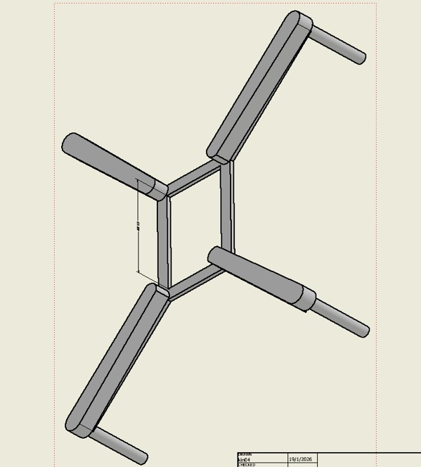

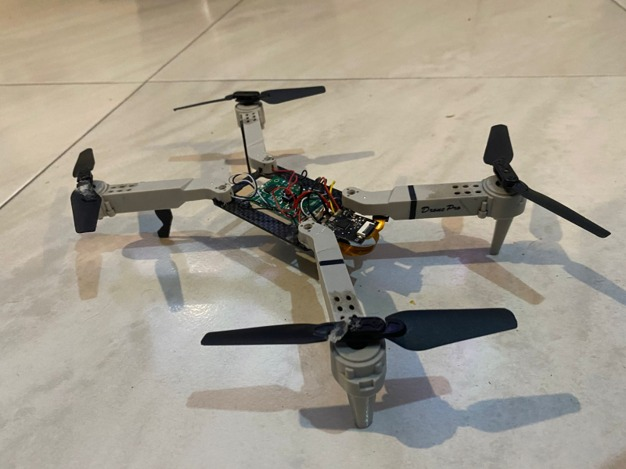

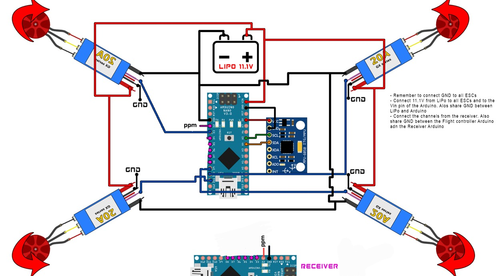

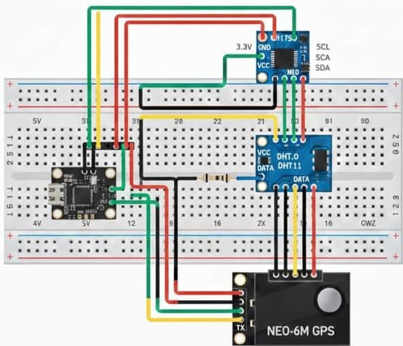

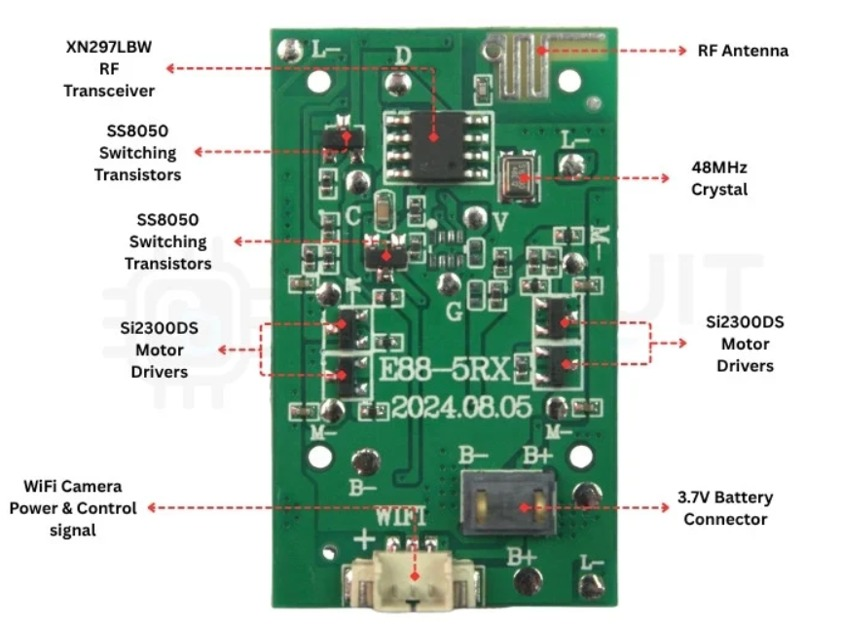

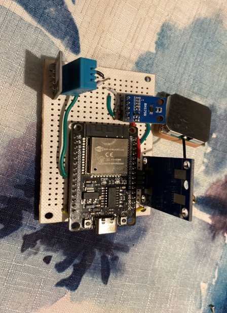

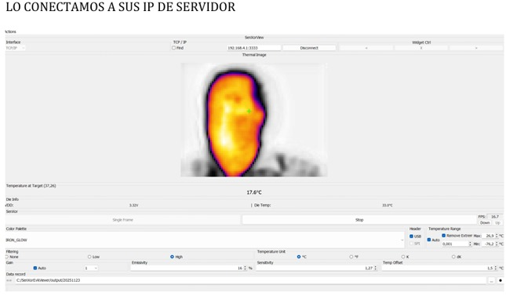

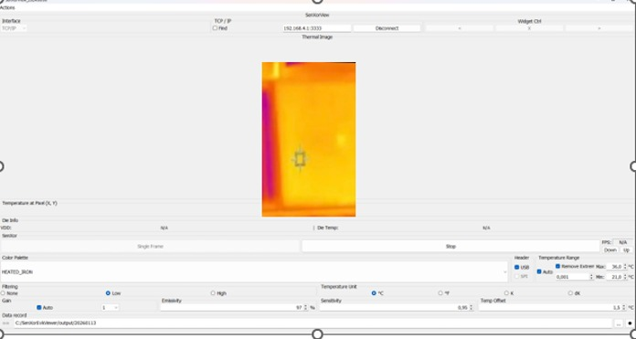

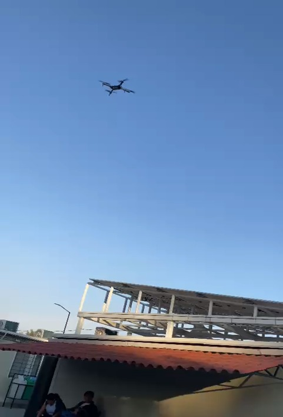

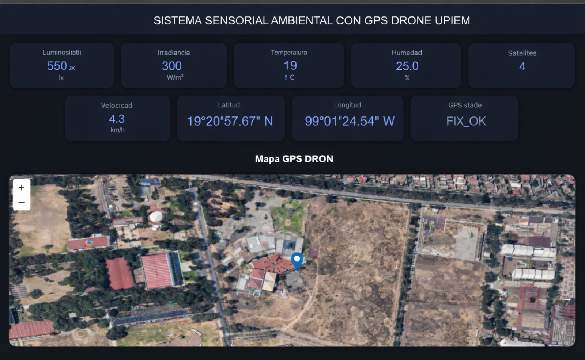

---

# 🛠️ Tecnologías utilizadas

- ESP32-S3
- Cámara térmica
- GPS NEO-6M
- Sensor DHT11
- Sensor BH1750
- Wi-Fi
- Arduino IDE
- Autodesk Inventor
- Diseño CAD
- Sistemas Embebidos
- Internet de las Cosas (IoT)

---

# ⚙️ Componentes principales

| Componente | Función |
|------------|----------|
| ESP32-S3 | Procesamiento principal y servidor web |
| Cámara térmica | Detección de puntos calientes |
| GPS NEO-6M | Geolocalización de inspecciones |
| DHT11 | Temperatura y humedad |
| BH1750 | Intensidad luminosa |
| Batería LiPo | Alimentación del sistema |
| Chasis del dron | Plataforma aérea |
| Motores Brushless | Sistema de propulsión |
| ESC | Control de velocidad de motores |

---

# 🚀 Beneficios del proyecto

✅ Disminución del tiempo de inspección.

✅ Detección temprana de fallas.

✅ Reducción de riesgos laborales.

✅ Eliminación de trabajos innecesarios en altura.

✅ Optimización del mantenimiento preventivo.

✅ Mayor seguridad para el personal.

✅ Incremento en la eficiencia de sistemas fotovoltaicos.

---
# 💼 Competencias demostradas

Este proyecto permitió aplicar conocimientos en:

- Automatización Industrial
- Sistemas Embebidos
- Internet de las Cosas (IoT)
- Energías Renovables
- Programación de Microcontroladores
- Diseño Mecánico
- Electrónica
- Redes Inalámbricas
- Integración de Hardware y Software
- Desarrollo de Interfaces Web

---

# 📄 Estado del proyecto

🟢 Proyecto finalizado como propuesta de titulación.

Actualmente se encuentra disponible como portafolio tecnológico para fines académicos y profesionales.

---

# 👨‍💻 Autor

## Oscar Arrieta Velasco

*Ingeniero en Sistemas Energéticos y Redes Inteligentes*

Instituto Politécnico Nacional (IPN)

Especializado en:

- Automatización Industrial
- Energías Renovables
- Sistemas Embebidos
- Inteligencia Artificial
- Internet de las Cosas (IoT)

---
